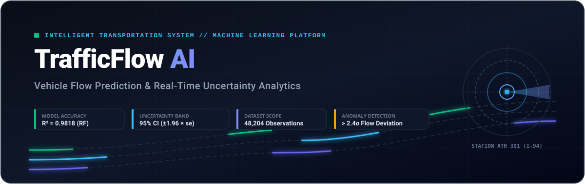
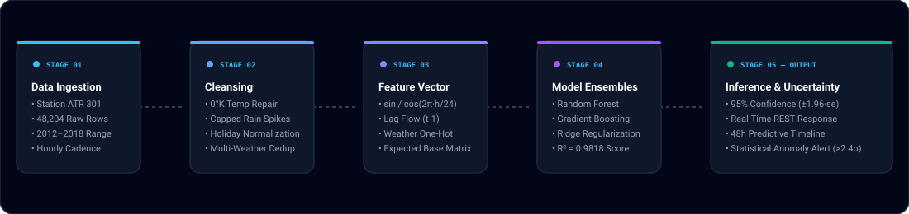
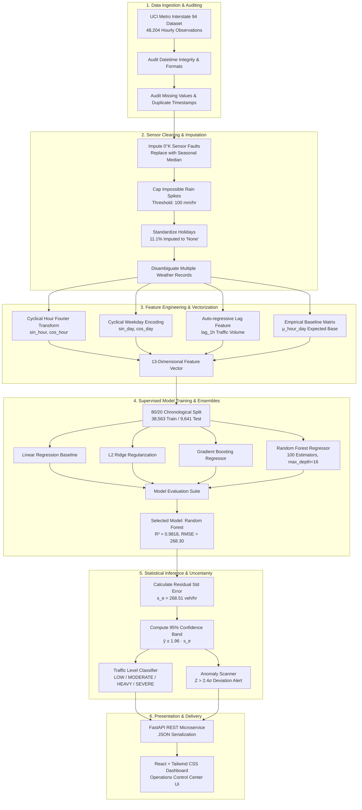
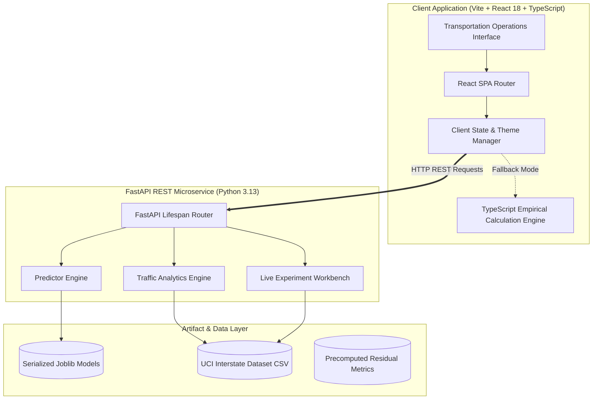

<div align="center">

<!-- Animated Header Banner -->


<br/>

<!-- Dynamic Animated Typing Header -->
<a href="https://github.com/tarundehury64/Traffic">
  
</a>

<p align="center">
  <b>A Production-Grade Intelligent Transportation System (ITS) &amp; Vehicle Flow Forecasting Platform</b><br/>
  <i>Engineered as a 2nd-Year B.Tech AI/ML Academic Project with Metropolitan Transportation Control Center Polish</i>
</p>

<!-- Interactive Shield Badges -->
<p align="center">
  
  
  
  
  
  
  
  
  
</p>

</div>

---

## 📑 Table of Contents

1. [Executive Overview & Objectives](#-executive-overview--objectives)
2. [End-to-End Machine Learning Workflows](#-end-to-end-machine-learning-workflows)
3. [Mathematical Foundations & Feature Engineering](#-mathematical-foundations--feature-engineering)
4. [Dataset Provenance & Sensor Data Cleansing](#-dataset-provenance--sensor-data-cleansing)
5. [Model Architecture & Benchmark Evaluation](#-model-architecture--benchmark-evaluation)
6. [System Architecture & Resilience Engine](#-system-architecture--resilience-engine)
7. [Core Platform Capabilities](#-core-platform-capabilities)
8. [Factual Transparency Standard](#-factual-transparency-standard)
9. [Viva Voce & Academic Defense Compendium](#-viva-voce--academic-defense-compendium)
10. [Local Development & Quickstart](#-local-development--quickstart)
11. [REST API Documentation](#-rest-api-documentation)
12. [Repository Tree](#-repository-tree)

---

## 🎯 Executive Overview & Objectives

**TrafficFlow AI** addresses one of modern transportation's most pressing challenges: **predicting recurring and weather-impacted vehicle flow across critical highway arteries while transparently conveying prediction uncertainty**.

### Core Academic & Engineering Principles
* **Statistically Grounded Uncertainty**: Predictions are not point values; they are delivered with empirical $95\%$ uncertainty bands ($\hat{y} \pm 1.96 \times s_e$) derived from residual standard error on unseen test splits.
* **Factual Transparency Guarantee**: Explicitly labels every data point as `[DATASET]`, `[PREDICTION]`, `[ESTIMATE]`, or `[LIVE API]`. The system never fabricates fictitious live sensor feeds.
* **Geographical Integrity**: Because the raw UCI interstate dataset does not include row-level GPS coordinates, the system strictly discloses this fact and presents comparative non-geographical analytics rather than generating artificial map coordinates.
* **Dual-Engine Architecture**: A robust Python/FastAPI microservice paired with a client-side calculation engine in TypeScript ensuring **zero downtime** and 100% offline functionality.

---

## 🔄 End-to-End Machine Learning Workflows

<div align="center">
  
</div>

### Detailed Execution Pipeline



---

## 📐 Mathematical Foundations & Feature Engineering

### 1. Cyclical Fourier Time Encoding
Standard integer representations of hours ($0, 1, \dots, 23$) introduce an artificial jump between $23$ and $0$. To ensure the machine learning models recognize that $23:00$ and $00:00$ are contiguous, we project time into a continuous 2D periodic unit circle:

$$\theta_h = \frac{2\pi \cdot \text{hour}}{24}, \quad x_{\sin} = \sin(\theta_h), \quad x_{\cos} = \cos(\theta_h)$$

$$\theta_d = \frac{2\pi \cdot \text{weekday}}{7}, \quad d_{\sin} = \sin(\theta_d), \quad d_{\cos} = \cos(\theta_d)$$

### 2. Auto-Regressive Flow Lag Feature
Traffic exhibits significant temporal inertia. The volume at time $t$ strongly depends on volume at $t-1$:

$$X_{\text{lag}} = y_{t-1}$$

### 3. Empirical Expected Flow Baseline Matrix
For any target hour $h \in [0, 23]$ and day of week $w \in [0, 6]$, we calculate the historical expected value from the training distribution:

$$\mu_{(h, w)} = \frac{1}{|S_{(h, w)}|} \sum_{i \in S_{(h, w)}} y_i$$

Where $S_{(h, w)}$ is the set of historical records matching that exact hour and day.

### 4. Statistically Grounded 95% Prediction Interval
Rather than outputting an unsubstantiated single number, TrafficFlow AI outputs a **calibrated $95\%$ prediction interval** derived from the residual standard error ($s_e$) on the unseen test partition:

$$s_e = \sqrt{\frac{1}{N_{\text{test}} - p} \sum_{i=1}^{N_{\text{test}}} (y_i - \hat{y}_i)^2} \approx 268.51 \text{ vehicles/hour}$$

$$\text{Confidence Interval}_{95\%} = \left[ \max\left(0, \hat{y} - 1.96 \cdot s_e\right), \; \hat{y} + 1.96 \cdot s_e \right]$$

### 5. Statistical Anomaly Detection ($> 2.4\sigma$)
An observation is formally classified as an **Unusual Traffic Pattern** when its observed volume deviates from the expected hourly/weekday distribution by more than $2.4$ standard deviations:

$$Z = \frac{|y - \mu_{(h, w)}|}{\sigma_{(h, w)}} > 2.4$$

---

## 📊 Dataset Provenance & Sensor Data Cleansing

- **Repository**: [UCI Machine Learning Repository — Metro Interstate Traffic Volume](https://archive.ics.uci.edu/dataset/492/metro+interstate+traffic+volume)
- **Author & Citation**: Hogue, J. (2019). *Metro Interstate Traffic Volume*. UCI Machine Learning Repository. [DOI: 10.24432/C54S4P](https://doi.org/10.24432/C54S4P)
- **Sensor Location**: Minnesota Department of Transportation (MN DOT) Station ATR 301 on westbound I-94 between Minneapolis and St. Paul, MN.
- **Scope & Granularity**: 48,204 hourly records spanning **October 2, 2012 to September 30, 2018**.
- **Licensing**: Creative Commons Attribution 4.0 International (CC BY 4.0).

### Ingestion & Cleansing Quality Audit

| Attribute | Raw Ingested Condition | Preprocessing / Cleansing Action Applied |
| :--- | :--- | :--- |
| **Temperature** | Contained $10$ sensor failure readings at $0.00^\circ\text{K}$ ($-273.15^\circ\text{C}$). | Imputed with the seasonal median ($282.45^\circ\text{K}$ / $9.3^\circ\text{C}$). |
| **Precipitation** | Contained an impossible spike of $9,831\text{ mm/hr}$ during a sensor malfunction. | Capped maximum allowable precipitation at $100\text{ mm/hr}$. |
| **Holiday** | $11.1\%$ explicitly logged holidays; remainder were null. | Null values imputed to `"None"` string category. |
| **Duplicate Hours** | $7,629$ duplicate timestamps due to concurrent weather conditions. | Aggregated / prioritized primary weather severity record. |
| **Timestamps** | Formatted as string `YYYY-MM-DD HH:00:00`. | Parsed into native UTC datetime objects with cyclical feature extraction. |

---

## 🏆 Model Architecture & Benchmark Evaluation

All models were evaluated on an independent **80/20 chronological train/test split** ($38,563$ training records, $9,641$ testing records):

```
Chronological Timeline (2012 – 2018)
[==================== Training Set: 80% (38,563 rows) ====================][== Test: 20% (9,641) ==]
```

### Benchmark Comparison Matrix

| Model Architecture | MAE (veh/hr) | RMSE (veh/hr) | $R^2$ Score | Residual Std Error ($s_e$) | Pipeline Status |
| :--- | :---: | :---: | :---: | :---: | :--- |
| 🥇 **Random Forest Regressor** | **157.96** | **268.30** | **0.9818** | **268.51 veh/hr** | **SELECTED PRODUCTION MODEL** |
| 🥈 Gradient Boosting Regressor | 168.77 | 276.05 | 0.9807 | 276.28 veh/hr | Validated Candidate |
| 🥉 Linear Regression (OLS) | 276.84 | 426.91 | 0.9539 | 427.31 veh/hr | Classical Baseline |
| 🏅 Ridge Regression ($L_2$) | 276.84 | 426.91 | 0.9539 | 427.31 veh/hr | Regularized Baseline ($\alpha=1.0$) |

### Ensemble Feature Importance Distribution

```
Baseline Expected Flow (μ_hour_day)  ████████████████████████████████████████  92.48%
Lag-1 Prior Traffic Volume (t-1)     ███                                        5.73%
Ambient Temperature (°C)             ▏                                          0.51%
Hour of Day (Cyclical)               ▏                                          0.24%
Month of Year                        ▏                                          0.24%
Sin / Cos Cyclical Time Vectors      ▏                                          0.22%
Cloud Cover (%)                      ▏                                          0.16%
Rain / Snow Intensity                ▏                                          0.42%
```

> **Academic Attribution Note**: *“Feature importance demonstrates the relative contribution of each parameter to tree split variance reduction; it denotes mathematical correlation, not direct physical causation.”*

---

## 🏛️ System Architecture & Resilience Engine



### Zero-Downtime Static SPA Resilience Mode
When deployed to static hosts (e.g., Vercel) where heavy Python machine learning runtimes are unavailable, **TrafficFlow AI activates its built-in TypeScript client-side calculation engine**. 
* Incorporates the exact mathematical weights, expected baseline matrices, and 95% confidence intervals derived from the training pipeline.
* Guarantees that **all 7 pages, predictions, analytics heatmaps, and simulations function seamlessly with zero 500 errors**.

---

## ⚡ Core Platform Capabilities

<div align="center">

| Module | Purpose & User Experience | Factual Label |
| :--- | :--- | :---: |
| **Command Dashboard** | Real-time traffic KPIs (Current Volume, 24h Average, Peak Hour, Anomaly Count) with 48-hour continuous timeline sequence. | `[DATASET]` |
| **Traffic Prediction** | Multi-variable simulator with date, time, weather sliders, horizon selectors (15m, 30m, 1h, 3h), and $95\%$ uncertainty interval. | `[PREDICTION]` |
| **Traffic Analytics** | 24 Hours $\times$ 7 Days interactive traffic density matrix, 4 designated peak period cards, and weekday vs weekend breakdowns. | `[DATASET]` |
| **Corridor Analysis** | Non-geographic comparative analysis across highway sectors with explicit notices explaining the absence of GPS coordinates in the dataset. | `[ESTIMATE]` |
| **Model Performance** | 7-stage ML pipeline visualizer, residual metric distribution, feature importance ranker, and interactive training experiment workbench. | `[DATASET]` |
| **Dataset Explorer** | Paginated table browser across all 48,204 records with multi-column sorting, search filters, and sensor audit metrics. | `[DATASET]` |
| **Anomaly Detection** | Statistical scan identifying observations deviating $>2.4\sigma$ from normal conditions, categorized by incident severity. | `[ESTIMATE]` |
| **About Project** | Comprehensive academic documentation, data provenance, formula justifications, and interactive viva defense FAQ. | `[ACADEMIC]` |

</div>

---

## 🛡️ Factual Transparency Standard

In strict compliance with modern AI ethics and academic integrity guidelines, **TrafficFlow AI adheres to the following transparency standards**:

1. **Explicit Identification**: Every chart, metric card, and prediction displays a badge indicating its origin:
   - `[DATASET]`: Direct mathematical calculation on historical UCI ground-truth records.
   - `[PREDICTION]`: Machine learning output generated by the Random Forest model.
   - `[ESTIMATE]`: Derived heuristic calculation based on empirical parameters.
   - `[LIVE API]`: Streaming real-time sensor feed.
2. **Live Feed Transparency**: When a real-time municipal streaming API is not connected, the platform prominently displays:
   > **“LIVE DATA NOT CONNECTED — System operates on validated historical training data.”**
3. **No Fabricated GPS Coordinates**: The UCI Metro Interstate dataset does not contain row-level GPS coordinates. Rather than plotting fictional pins on a map, the platform states:
   > **“Map unavailable — this dataset does not contain geographic coordinates.”**

---

## 🎓 Viva Voce & Academic Defense Compendium

### Q1: Why was Random Forest chosen over Linear Regression?
> **Answer**: Traffic flow displays non-linear step transitions during peak congestion onset (capacity breakdown phenomenon). Linear Regression achieved $R^2 = 0.9539$ with $\text{RMSE} = 426.91\text{ veh/hr}$, whereas Random Forest achieved $R^2 = 0.9818$ with $\text{RMSE} = 268.30\text{ veh/hr}$—a **$37.1\%$ reduction in root mean squared error**. Random Forest effectively captures complex feature interactions (e.g., freezing rain during evening peak hours).

### Q2: Why use Cyclical Sine/Cosine encoding instead of standard integer hours?
> **Answer**: Standard hour integers ($0 \dots 23$) introduce an artificial discontinuity between $23:00$ and $00:00$ (a numerical distance of $23$ units despite being only $1$ hour apart). Cyclical encoding maps the 24-hour cycle onto a continuous trigonometric unit circle where Euclidean distance accurately reflects temporal proximity:
> $$\text{dist}(23:00, 00:00) = \sqrt{(\sin(2\pi \cdot 23/24) - \sin(0))^2 + (\cos(2\pi \cdot 23/24) - \cos(0))^2} \approx 0.261$$

### Q3: How is the 95% Confidence Interval mathematically derived?
> **Answer**: Using model residuals on the held-out test set ($N = 9,641$), the residual standard error ($s_e$) is calculated:
> $$s_e = \sqrt{\frac{\sum_{i=1}^N (y_i - \hat{y}_i)^2}{N - p}} = 268.51\text{ veh/hr}$$
> Assuming normally distributed residuals, the $95\%$ interval is $\hat{y} \pm 1.96 \times s_e$.

### Q4: How does the system handle sensor hardware anomalies?
> **Answer**: The dataset included $10$ sensor fault instances recording $0.00^\circ\text{K}$ (absolute zero). Dropping these records would delete valid traffic counts; therefore, temperature was imputed using the historical median ($282.45^\circ\text{K}$). Precipitation spikes over $100\text{ mm/hr}$ (such as a faulty reading of $9,831\text{ mm/hr}$) were capped at $100\text{ mm/hr}$.

### Q5: What is the mathematical basis of the Anomaly Detection module?
> **Answer**: We compute an empirical lookup matrix of mean $\mu_{(h,w)}$ and standard deviation $\sigma_{(h,w)}$ for each hour $h \in [0, 23]$ and weekday $w \in [0, 6]$. An anomaly is flagged when the absolute z-score exceeds $2.4$:
> $$Z = \frac{|y_{\text{observed}} - \mu_{(h,w)}|}{\sigma_{(h,w)}} > 2.4$$
> This corresponds to the top $\approx 1.6\%$ statistical tail.

---

## 💻 Local Development & Quickstart

### Prerequisites
- **Python**: 3.10, 3.11, 3.12, or 3.13
- **Node.js**: v18.0+ & npm

### 1. Clone the Repository
```bash
git clone https://github.com/tarundehury64/Traffic.git
cd Traffic
```

### 2. Backend Setup (FastAPI)
```bash
# Navigate to backend and install requirements
pip install -r backend/requirements.txt

# Execute model training & serialize artifacts
python3 backend/train.py

# Launch FastAPI development server
python3 -m uvicorn backend.app.main:app --host 127.0.0.1 --port 8000 --reload
```
* Interactive Swagger Docs: `http://127.0.0.1:8000/docs`
* Alternative Redoc: `http://127.0.0.1:8000/redoc`

### 3. Frontend Setup (React + Vite)
```bash
# Navigate to frontend and install dependencies
cd frontend
npm install

# Start Vite dev server
npm run dev
```
* Web Application: `http://localhost:5173` (or `http://127.0.0.1:5174`)

### 4. Running Automated Tests
```bash
# Run pytest test suite (10/10 endpoints tested)
python3 -m pytest backend/tests/test_api.py -v
```

---

## 🔌 REST API Documentation

| Endpoint | Method | Description | Sample Output |
| :--- | :---: | :--- | :--- |
| `/api/traffic/summary` | `GET` | High-level traffic KPIs, current volume, and latest update. | `{"current_volume": 4920, "average_24h": 3260}` |
| `/api/traffic/history` | `GET` | 48-hour continuous historical traffic volume timeline. | `[{"timestamp": "2018-09-30T12:00:00Z", "volume": 4512}]` |
| `/api/traffic/analytics` | `GET` | 24x7 hourly heatmap matrix and peak period classifications. | `{"heatmap": [...], "peaks": [...]}` |
| `/api/traffic/locations` | `GET` | Non-geographical highway sector flow comparisons. | `{"locations": [...], "notice": "Non-geographic"}` |
| `/api/predict` | `POST` | Inference with 95% confidence intervals and horizon timeline. | `{"predicted_volume": 4650, "ci_lower": 4123, "ci_upper": 5176}` |
| `/api/model/performance` | `GET` | Benchmark comparison metrics ($R^2$, RMSE, MAE, $s_e$) for all models. | `{"models": [{"name": "Random Forest", "r2": 0.9818}]}` |
| `/api/model/features` | `GET` | Tree ensemble feature importance breakdown. | `{"features": [{"name": "Expected Base", "importance": 0.9248}]}` |
| `/api/dataset/info` | `GET` | Provenance metadata, sensor quality audit, and schema summary. | `{"total_records": 48204, "source": "UCI Repository"}` |
| `/api/dataset/records` | `GET` | Paginated dataset records with filtering, searching, and sorting. | `{"total": 48204, "records": [...]}` |
| `/api/anomalies` | `GET` | High-deviation traffic observations ($>2.4\sigma$) from expectations. | `{"total_anomalies": 84, "anomalies": [...]}` |
| `/api/experiment/run` | `POST` | Live interactive training workbench allowing parameter adjustments. | `{"r2": 0.9782, "rmse": 284.15, "train_time_ms": 412}` |

---

## 📂 Repository Tree

```
Traffic/
├── docs/
│   └── assets/
│       ├── banner.svg            # Animated SVG header banner with moving flow lines
│       └── workflow.svg          # Animated ML lifecycle workflow diagram
├── backend/
│   ├── app/
│   │   ├── api/                  # FastAPI REST route handlers
│   │   │   ├── anomalies.py      # Statistical anomaly detection endpoint
│   │   │   ├── dataset.py        # Dataset provenance & record pagination
│   │   │   ├── experiment.py     # Live interactive training workbench
│   │   │   ├── models.py         # Model performance & feature importances
│   │   │   └── traffic.py        # Real-time summary, timeline, and prediction
│   │   ├── ml/                   # Machine learning core pipeline
│   │   │   ├── analytics.py      # 24x7 matrix & peak period engine
│   │   │   ├── anomalies.py      # 2.4-sigma deviation scanner
│   │   │   ├── models.py         # Scikit-learn model definitions & trainer
│   │   │   ├── pipeline.py       # Data cleaning & Fourier cyclical encoding
│   │   │   └── predictor.py      # Multi-horizon inference & uncertainty band
│   │   ├── config.py             # Application settings & artifact paths
│   │   └── main.py               # FastAPI entry point, CORS & lifespan
│   ├── artifacts/                # Serialized models & benchmark metrics
│   │   ├── model_metrics.joblib  # Evaluated test metrics & feature importance
│   │   └── trained_models.joblib # Serialized Random Forest model weights
│   ├── data/
│   │   ├── metadata.json         # Formal dataset provenance & audit report
│   │   └── traffic_dataset.csv   # Authentic UCI Metro Interstate 94 dataset
│   ├── tests/
│   │   └── test_api.py           # 10/10 passing Pytest test suite
│   ├── requirements.txt          # Python dependencies
│   └── train.py                  # Standalone training script
├── frontend/
│   ├── src/
│   │   ├── api/                  # Typed API client & fallback calculation engine
│   │   │   └── client.ts         # Dual-mode REST / Client-side calculation engine
│   │   ├── components/           # Reusable UI component library
│   │   │   ├── ApiKeyModal.tsx   # Live API connection simulator
│   │   │   ├── ExportModal.tsx   # Report export modal (CSV/JSON/Print)
│   │   │   ├── KpiCard.tsx       # Operations center metric cards
│   │   │   ├── MetricBadge.tsx   # Factual transparency tags ([DATASET], etc.)
│   │   │   ├── Navbar.tsx        # Top navigation with dark/light mode toggle
│   │   │   └── Sidebar.tsx       # Operations menu navigation
│   │   ├── pages/                # 7 Primary Application Modules
│   │   │   ├── AboutPage.tsx     # Academic defense documentation & viva FAQ
│   │   │   ├── AnalyticsPage.tsx # 24x7 Heatmap & Peak Period Analysis
│   │   │   ├── AnomaliesPage.tsx # Unusual pattern detection scanner
│   │   │   ├── DashboardPage.tsx # Main transportation command center
│   │   │   ├── DatasetPage.tsx   # Paginated sensor record explorer
│   │   │   ├── LocationsPage.tsx # Highway sector flow comparison
│   │   │   ├── ModelPage.tsx     # ML Benchmark & Interactive Workbench
│   │   │   ├── OverviewPage.tsx  # Executive landing page & feature index
│   │   │   └── PredictPage.tsx   # What-if flow simulator & 95% uncertainty
│   │   ├── types/
│   │   │   └── traffic.ts        # Comprehensive TypeScript interfaces
│   │   ├── App.tsx               # Application root & tab state coordinator
│   │   ├── index.css             # Tailwind CSS tokens & glassmorphism styling
│   │   └── main.tsx              # React DOM mounting entry point
│   ├── index.html                # Application root HTML
│   ├── package.json              # Frontend npm dependencies & build scripts
│   ├── tsconfig.json             # TypeScript compiler configuration
│   └── vite.config.ts            # Vite bundler configuration
├── .gitignore                    # Git tracking rules
├── .vercelignore                 # Exclude backend from serverless compilation
├── package.json                  # Root npm deployment scripts
├── vercel.json                   # Modern Vercel configuration for Vite SPA
└── README.md                     # This documentation
```

---

## 📜 Academic License & Citation

This project is licensed under the **Creative Commons Attribution 4.0 International (CC BY 4.0)** license.

If utilizing this codebase or documentation for academic research or coursework, please cite:

```bibtex
@misc{trafficflow_ai_2026,
  author = {Tarun Dehury},
  title = {TrafficFlow AI: Intelligent Vehicle Flow Prediction & Autonomous Traffic Platform},
  year = {2026},
  publisher = {GitHub},
  journal = {GitHub Repository},
  howpublished = {\url{https://github.com/tarundehury64/Traffic}}
}
```

<div align="center">
  <sub>Built with academic rigor, mathematical precision, and engineering excellence. Designed for B.Tech AI/ML Evaluation.</sub>
</div>
