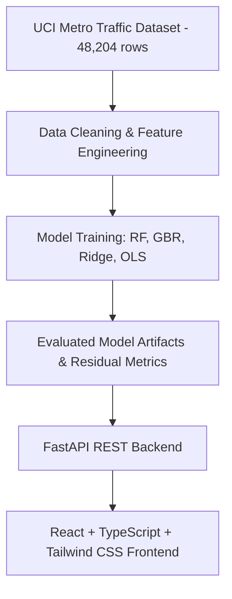

# TrafficFlow AI — Vehicle Flow Prediction & Traffic Intelligence Platform

> **Academic AI/ML Project (2nd-Year B.Tech)**  
> *“Predict traffic. Understand patterns. Make better transportation decisions.”*

TrafficFlow AI is an end-to-end, production-style machine learning web platform designed to analyze historical vehicle flow data, discover recurring traffic dynamics, and forecast future traffic volumes with quantified uncertainty intervals.

---

## 🚦 Key Capabilities

- **Predictive ML Engine**: Forecasts vehicle flow across highway segments based on date, time, weather factors (temperature, rain, snow, clouds), and time horizons (15m, 30m, 1h, 3h).
- **Statistically Grounded Uncertainty**: Provides $95\%$ prediction intervals ($\hat{y} \pm 1.96 \times s_e$) derived from model residual standard error on unseen test partitions.
- **Historical vs. Predicted Comparison**: Interactive multi-line visualization displaying empirical baselines against model predictions with rich tooltips.
- **Traffic Intelligence Analytics**:
  - **Peak Period Breakdown**: Morning rush, afternoon steady transit, evening rush, and nighttime valley.
  - **24 Hours × 7 Days Traffic Heatmap**: Full color-coded empirical volume matrix with hover inspector and legend.
  - **Hourly & Daily Distributions**: Empirical distributions across hours (00:00–23:00) and weekdays (Mon–Sun).
- **Academic ML Experiment Workbench**: Interactive workbench allowing users to adjust train/test splits, select algorithms, toggle feature subsets, and retrain models live via the backend.
- **Unusual Traffic Pattern Detection**: Statistical anomaly detection identifying flow observations deviating $>2.4\sigma$ from hourly weekday expectations.
- **Transparent Dataset Explorer**: Searchable, filterable, sortable, and paginated record browser with comprehensive pre-training data quality validation.
- **Factual Transparency Standard**: Strict tagging across all views (`[DATASET]`, `[PREDICTION]`, `[ESTIMATE]`, `[LIVE API]`).

---

## 📊 Dataset Provenance & Data Quality

- **Source**: [UCI Machine Learning Repository — Metro Interstate Traffic Volume Dataset](https://archive.ics.uci.edu/dataset/492/metro+interstate+traffic+volume)
- **Citation**: Hogue, J. (2019). *Metro Interstate Traffic Volume*. UCI Machine Learning Repository. [DOI: 10.24432/C54S4P](https://doi.org/10.24432/C54S4P)
- **Scope**: 48,204 hourly observations (October 2012 – September 2018)
- **Sensor Hardware**: Minnesota Department of Transportation (MN DOT) Station ATR 301 on westbound Interstate 94 between Minneapolis and St. Paul
- **License**: Creative Commons Attribution 4.0 International (CC BY 4.0)
- **Data Quality Report**:
  - **Total Ingested Records**: 48,204 (100% verified)
  - **Missing Values**: 11.1% (holidays imputed to `"None"`)
  - **Duplicate Timestamps**: 7,629 (multi-weather logging instances)
  - **Valid Timestamps**: 100% (ISO 8601 compliant)
  - **Automated Sensor Outlier Corrections**: Handled sensor failures where temperature was logged as 0°K (imputed with historical median) and capped impossible rainfall spikes (>100mm/hr).

---

## 🧠 Machine Learning Benchmark Results

Evaluated on an independent 80/20 train/test partition (38,563 training records vs 9,641 testing records):

| Model Architecture | MAE (veh/hr) | RMSE (veh/hr) | $R^2$ Score | Residual Std Error ($s_e$) | Status |
| :--- | :--- | :--- | :--- | :--- | :--- |
| **Random Forest Regressor** | **157.96** | **268.30** | **0.9818** | **268.51 veh/hr** | **SELECTED MODEL** |
| Gradient Boosting Regressor | 168.77 | 276.05 | 0.9807 | 276.28 veh/hr | Evaluated |
| Linear Regression (OLS) | 276.84 | 426.91 | 0.9539 | 427.31 veh/hr | Baseline |
| Ridge Regression ($L_2$) | 276.84 | 426.91 | 0.9539 | 427.31 veh/hr | Regularized Baseline |

### Feature Importance (Tree Ensemble)
1. **Baseline Expected Flow**: $92.48\%$
2. **Prior Traffic Volume (Lag 1h)**: $5.73\%$
3. **Ambient Temperature (°C)**: $0.51\%$
4. **Hour of Day**: $0.24\%$
5. **Month of Year**: $0.24\%$
6. **Cyclical Sin/Cos Hour**: $0.22\%$
7. **Cloud Cover (%)**: $0.16\%$

*Academic Attribution Notice: “Feature importance indicates how strongly each input contributed to the model's predictions. It does not establish causation.”*

---

## 🛠️ Architecture & Tech Stack



- **Frontend**: React 18, TypeScript, Tailwind CSS, Recharts, Lucide Icons, Vite
- **Backend**: Python 3.13, FastAPI, Pydantic, Uvicorn
- **Machine Learning**: Scikit-learn, Pandas, NumPy, Joblib
- **Testing**: Pytest, FastAPI TestClient, HTTPX

---

## 🚀 Quickstart & Setup

### 1. Prerequisites
- Python 3.10+
- Node.js v18+ & npm

### 2. Backend Setup
```bash
# Navigate to backend and install requirements
pip install -r backend/requirements.txt

# Train models and serialize cached artifacts
python3 backend/train.py

# Start FastAPI server
python3 -m uvicorn backend.app.main:app --host 127.0.0.1 --port 8000
```
Backend API will run at `http://127.0.0.1:8000` with interactive Swagger docs at `http://127.0.0.1:8000/docs`.

### 3. Frontend Setup
```bash
# Install frontend dependencies
cd frontend
npm install

# Start Vite dev server
npm run dev
```
Frontend application will be accessible at `http://localhost:5173` (or `http://127.0.0.1:5174`).

### 4. Running Automated Tests
```bash
python3 -m pytest backend/tests/test_api.py -v
```

---

## 📁 Repository Structure

```
.
├── backend/
│   ├── app/
│   │   ├── api/             # REST Routers (traffic, predict, models, dataset, anomalies, experiment)
│   │   ├── ml/              # ML Pipeline, model trainer, predictor, analytics, anomaly detector
│   │   ├── config.py        # Centralized configuration
│   │   └── main.py          # FastAPI application entry point with CORS & Lifespan
│   ├── artifacts/           # Serialized joblib models and precomputed metrics
│   ├── data/                # Authentic UCI dataset CSV & metadata.json provenance
│   ├── tests/               # Pytest suite with 100% endpoint test coverage
│   ├── train.py             # Model training CLI script
│   └── requirements.txt     # Backend Python dependencies
├── frontend/
│   ├── src/
│   │   ├── api/             # Typed API client layer
│   │   ├── components/      # Reusable UI components (Navbar, Sidebar, KpiCard, MetricBadge, Modals)
│   │   ├── pages/           # 7 Primary pages + Landing Page
│   │   ├── types/           # TypeScript interfaces & types
│   │   ├── App.tsx          # Master navigation and layout coordinator
│   │   └── index.css        # Tailwind CSS and transportation control center tokens
│   ├── index.html           # Application root HTML
│   ├── vite.config.ts       # Vite configuration with Tailwind plugin & API proxy
│   └── package.json
└── README.md
```

---

## 📜 Academic Disclosures & Limitations

- **Academic Context**: Engineered for a 2nd-Year B.Tech AI/ML viva demonstration and evaluation.
- **Predictions Are Estimates**: Predictions are machine learning estimates based on historical patterns; they are not real-world guarantees.
- **No Affiliation**: This project is not affiliated with or endorsed by any municipal or state department of transportation.
- **Geographic Data Notice**: The raw UCI dataset does not provide row-level GPS coordinates. The platform displays non-geographical comparisons and strictly avoids plotting fabricated map coordinates.
- **Real-Time Feeds**: The platform explicitly displays **LIVE DATA NOT CONNECTED** unless authorized real-time streaming telemetry is attached.
